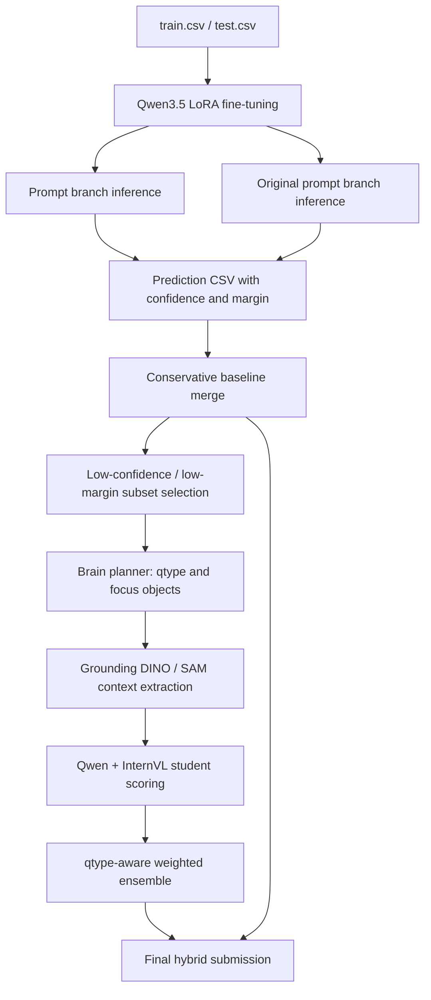

# 🏆 재활용품 이미지 기반 VQA 모델 | 193팀 중 전국 1위

삼성 청년 SW/AI 아카데미 SSAFY 15기 2회차 AI 챌린지에서 재활용품 이미지 기반 질의응답(VQA) 모델을 개발해 193팀 중 전국 1위를 달성한 최종 솔루션입니다.

이 프로젝트는 이미지, 질문, 4지선다 보기(a, b, c, d)가 주어졌을 때 이미지 속 단서를 근거로 정답 보기를 예측합니다. 단순한 이미지 분류가 아니라 질문 의도를 해석하고, 보기 간 차이를 비교하며, 모델이 불확실한 샘플만 추가 분석하는 하이브리드 파이프라인으로 구성했습니다.

<p align="center">
  
</p>

<p align="center">
  <strong>SSAFY AI Challenge 최우수상</strong><br>
  193팀이 경쟁한 재활용품 VQA 챌린지에서 Private leaderboard 기준 최종 1위를 기록했습니다.
</p>

## 프로젝트 요약

<table>
  <tbody>
    <tr>
      <th align="left" width="140" nowrap="nowrap"><nobr>대회</nobr></th>
      <td>SSAFY 15기 2회차 AI 챌린지</td>
    </tr>
    <tr>
      <th align="left" width="140" nowrap="nowrap"><nobr>참가 규모</nobr></th>
      <td>193팀</td>
    </tr>
    <tr>
      <th align="left" width="140" nowrap="nowrap"><nobr>프로젝트 주제</nobr></th>
      <td>재활용품 이미지 기반 질의응답(VQA) 모델 개발</td>
    </tr>
    <tr>
      <th align="left" width="140" nowrap="nowrap"><nobr>입력 형식</nobr></th>
      <td>이미지 + 자연어 질문 + 4지선다 보기(a, b, c, d)</td>
    </tr>
    <tr>
      <th align="left" width="140" nowrap="nowrap"><nobr>최종 성과</nobr></th>
      <td><strong>193팀 중 전국 1위</strong></td>
    </tr>
    <tr>
      <th align="left" width="140" nowrap="nowrap"><nobr>핵심 전략</nobr></th>
      <td>Qwen LoRA 파인튜닝, 선택지 순서 TTA, confidence/margin 기반 앙상블, DINO/SAM 재추론, Qwen/InternVL qtype별 가중 앙상블</td>
    </tr>
  </tbody>
</table>

## 최종 리더보드

대회 종료 후 최종 순위를 반영하는 Private leaderboard에서 193팀 중 1위를 기록했습니다.

| Leaderboard | Rank | Score | Entries |
| --- | ---: | ---: | ---: |
| Private | 1st | 0.97635 | 54 |
| Public | 1st | 0.96452 | 54 |

### Private Leaderboard


### Public Leaderboard


## 팀 구성

<table>
  <thead>
    <tr>
      <th>이름</th>
      <th>역할</th>
      <th>담당 내용</th>
    </tr>
  </thead>
  <tbody>
    <tr>
      <td nowrap="nowrap"><nobr>조&#8288;성&#8288;익</nobr></td>
      <td nowrap="nowrap"><nobr>팀&#8288;장</nobr></td>
      <td nowrap="nowrap"><nobr>프로젝트 일정 관리, 데이터 분석, baseline 모델 실험 및 앙상블, 오답 패턴 정리</nobr></td>
    </tr>
    <tr>
      <td nowrap="nowrap"><nobr>장&#8288;민&#8288;주</nobr></td>
      <td nowrap="nowrap"><nobr>팀&#8288;원</nobr></td>
      <td nowrap="nowrap"><nobr>전체 솔루션 방향 제안, Qwen LoRA fine-tuning, DINO/SAM 기반 focus context 생성, 최종 파이프라인 구성</nobr></td>
    </tr>
    <tr>
      <td nowrap="nowrap"><nobr>박&#8288;종&#8288;화</nobr></td>
      <td nowrap="nowrap"><nobr>팀&#8288;원</nobr></td>
      <td nowrap="nowrap"><nobr>보기 순서 TTA 실험, 모델별 예측 결과 비교(모델 선정), 프롬프트 엔지니어링</nobr></td>
    </tr>
    <tr>
      <td nowrap="nowrap"><nobr>남&#8288;주&#8288;현</nobr></td>
      <td nowrap="nowrap"><nobr>팀&#8288;원</nobr></td>
      <td nowrap="nowrap"><nobr>주요 오답 패턴 정리, InternVL 비교 실험, qtype별 성능 분석 및 분류 기준 정리</nobr></td>
    </tr>
    <tr>
      <td nowrap="nowrap"><nobr>고&#8288;은&#8288;찬</nobr></td>
      <td nowrap="nowrap"><nobr>팀&#8288;원</nobr></td>
      <td nowrap="nowrap"><nobr>오답 패턴 정리, 리더 보드 관리, 코드 버전 관리, 아이디어 제안</nobr></td>
    </tr>
  </tbody>
</table>

## 문제 정의

대회 데이터는 재활용품 이미지와 질문/보기 쌍으로 구성됩니다.

```text
입력:
- image
- question
- a, b, c, d choices

출력:
- answer: one of a, b, c, d
```

예시는 다음과 같습니다.

```text
질문: 바구니 속에 든 재활용품은 어떤 소재인가요?
보기: a. 캔  b. 병  c. 플라스틱  d. 비닐
정답: c
```

이 문제에서 어려웠던 부분은 다음 세 가지였습니다.

- 보기 텍스트가 비슷하거나 질문 조건이 세밀하면 범용 VLM이 쉽게 헷갈립니다.
- 개수(count), 재질(material), 분리배출(recycle) 유형은 이미지 전체보다 특정 객체를 정확히 보는 능력이 중요합니다.
- 모델의 raw confidence만 믿으면 오답도 강하게 확신하는 경우가 있어, margin과 qtype별 취약점 분석이 필요했습니다.

## 솔루션 구조

최종 솔루션은 "강한 기본 모델을 만들고, 불확실한 문제만 비싼 추론으로 다시 본다"는 전략으로 설계했습니다.



## 핵심 아이디어

### 1. Choice-aware fine-tuning

일반적인 생성형 loss로 답변 문장을 학습시키는 대신, 최종 출력이 a/b/c/d 중 하나라는 문제 구조를 적극 활용했습니다.

- Qwen3.5 기반 LoRA/QLoRA 파인튜닝
- 4개 보기 토큰에 대한 직접 cross-entropy(`choice_ce`) 지원
- 보기 순서 셔플로 특정 라벨 위치에 과적합되는 현상 완화
- validation/test에서 보기 순서를 바꿔 여러 번 추론하는 TTA 적용

### 2. Confidence와 margin 기반 보수적 앙상블

두 개의 Qwen 예측 branch를 만들고, 단순 다수결이 아니라 `confidence`, `margin_top2`를 비교해 더 안정적인 답만 선택했습니다.

- 기본 branch를 유지
- 대체 branch가 충분히 높은 margin/confidence를 보일 때만 교체
- 최종 제출 CSV와 별도로 meta CSV를 저장해 어떤 branch가 선택됐는지 추적

### 3. 취약 qtype만 재추론

모든 샘플에 무거운 멀티스테이지 추론을 적용하지 않고, count처럼 취약한 유형과 낮은 confidence/margin 샘플만 골라 재추론했습니다.

- `support_conf_mean`, `support_margin_mean` 기반 subset 생성
- test target answer를 참조하지 않는 answer-free selector
- count 유형 중심으로 DINO/SAM과 InternVL 보강

### 4. DINO/SAM 기반 focus context

질문에 필요한 객체를 먼저 찾고, 필요한 경우 crop/focus panel을 만들어 VLM이 작은 물체나 개수 조건을 더 잘 보도록 했습니다.

- Brain planner가 question type과 focus object를 추출
- Grounding DINO로 객체 후보 박스 탐지
- SAM으로 박스 refinement
- 원본 이미지와 focus panel을 결합해 student VLM에 입력

### 5. Qwen/InternVL qtype별 가중 앙상블

모델마다 잘하는 문제 유형이 달라서, qtype별로 Qwen과 InternVL의 가중치를 다르게 적용했습니다.

- count/dominant/location: InternVL 비중을 더 높게 설정
- material/recycle/state/type: Qwen 비중을 더 높게 설정
- detector prior는 count처럼 실제로 도움이 되는 유형에만 제한적으로 반영

## 파일 구성

| 파일 | 역할 |
| --- | --- |
| `train_qwen35_choice_ft_prompt.py` | Qwen3.5 choice-aware LoRA 학습 및 test inference |
| `train_qwen35_choice_ft_ori_prompt.py` | 원본 prompt branch용 Qwen3.5 학습 및 추론 |
| `internvl_baseline.py` | InternVL LoRA baseline 및 confidence 추출 |
| `multistage_vqa.py` | Brain planner, Grounding DINO, SAM, Qwen/InternVL student ensemble 핵심 모듈 |
| `colab_three_pass_multistage.py` | Colab 환경에서 brain/context/student 3-pass 재추론 실행 |
| `build_margin_baseline_submission.py` | 두 예측 branch를 margin/confidence 기준으로 보수 병합 |
| `prepare_rerun_subset.py` | 불확실한 qtype/sample만 재추론 대상으로 선택 |
| `build_final_hybrid_submission.py` | baseline과 rerun 결과를 결합해 최종 제출 파일 생성 |

## 실행 환경

GPU 환경에서는 PyTorch 설치 방식이 다를 수 있으므로, 먼저 환경에 맞는 PyTorch를 설치한 뒤 나머지 패키지를 설치하는 것을 권장합니다.

```bash
pip install -r requirements.txt
```

예상 데이터 형식은 다음과 같습니다.

```text
project_root/
  train.csv
  test.csv
  images/
```

`train.csv`는 최소한 `id`, `path`, `question`, `a`, `b`, `c`, `d`, `answer` 컬럼을 포함해야 합니다. `test.csv`는 `answer`를 제외한 동일한 입력 컬럼을 사용합니다.

## 실행 방법

### 1. Qwen branch 학습 및 추론

```bash
python train_qwen35_choice_ft_ori_prompt.py \
  --project-root /path/to/project \
  --train-csv /path/to/train.csv \
  --test-csv /path/to/test.csv \
  --image-root /path/to/project \
  --output-dir /path/to/ori_prompt_run
```

```bash
python train_qwen35_choice_ft_prompt.py \
  --project-root /path/to/project \
  --train-csv /path/to/train.csv \
  --test-csv /path/to/test.csv \
  --image-root /path/to/project \
  --output-dir /path/to/prompt_run
```

각 branch는 다음 파일을 생성합니다.

- `test_predictions_detailed.csv`
- `submission.csv`

`test_predictions_detailed.csv`에는 최종 병합에 필요한 `id`, `answer`, `confidence`, `margin_top2`가 포함됩니다.

### 2. Baseline submission 생성

```bash
python build_margin_baseline_submission.py \
  --primary-csv /path/to/ori_prompt_run/test_predictions_detailed.csv \
  --secondary-csv /path/to/prompt_run/test_predictions_detailed.csv \
  --output-csv /path/to/baseline_submission.csv \
  --meta-csv /path/to/baseline_submission_meta.csv \
  --prefer-source primary \
  --min-margin-top2 0.90 \
  --min-margin-gap 0.02 \
  --min-confidence-gap 0.01
```

### 3. Rerun subset 생성

```bash
python prepare_rerun_subset.py \
  --test-csv /path/to/test.csv \
  --signal-csv /path/to/signal.csv \
  --output-csv /path/to/rerun_subset.csv \
  --output-ids /path/to/rerun_subset_ids.txt \
  --qtypes count \
  --conf-threshold 0.88 \
  --margin-threshold 0.50
```

### 4. DINO/SAM multistage 재추론

```bash
python colab_three_pass_multistage.py \
  --project-root /path/to/project \
  --source test \
  --html-subset /path/to/rerun_subset.csv \
  --subset-ids-path /path/to/rerun_subset_ids.txt \
  --subset-tag rerun_subset \
  --adapter-path /path/to/qwen_adapter \
  --enable-sam \
  --force-rerun-student \
  --batch-save-every 10
```

InternVL student를 함께 사용할 경우:

```bash
python colab_three_pass_multistage.py \
  --project-root /path/to/project \
  --source test \
  --html-subset /path/to/rerun_subset.csv \
  --subset-ids-path /path/to/rerun_subset_ids.txt \
  --subset-tag rerun_subset \
  --adapter-path /path/to/qwen_adapter \
  --enable-internvl \
  --internvl-adapter-path /path/to/internvl_adapter \
  --enable-sam \
  --force-rerun-student
```

주요 산출물:

- `{tag}_brain_plan.csv`
- `{tag}_context_summary.csv`
- `{tag}_detections.csv`
- `{tag}_crops.csv`
- `{tag}_predictions_full.csv`
- `{tag}_answer.csv`

### 5. Final hybrid submission 생성

```bash
python build_final_hybrid_submission.py \
  --baseline-csv /path/to/baseline_submission.csv \
  --rerun-predictions-csv /path/to/rerun_subset_predictions_full.csv \
  --signal-csv /path/to/signal.csv \
  --output-csv /path/to/final_submission.csv \
  --meta-csv /path/to/final_submission_meta.csv \
  --qtypes count \
  --conf-threshold 0.88 \
  --margin-threshold 0.50
```

## 회고

이 대회에서 가장 효과적이었던 지점은 모델을 무조건 크게 만드는 것이 아니라, 문제의 실패 양상을 관찰하고 그에 맞게 추론 비용을 배분한 것입니다.

- 생성형 답변보다 4지선다 구조를 직접 학습하는 방식이 안정적이었습니다.
- 보기 순서 셔플과 TTA는 라벨 위치 편향을 줄이는 데 도움이 됐습니다.
- count 유형은 VLM 단독보다 detector prior와 InternVL 보조가 더 강했습니다.
- DINO/SAM은 모든 문제에 쓰기보다 qtype과 confidence를 기준으로 제한 적용할 때 효율이 좋았습니다.
- 최종 성능은 단일 모델보다 error analysis, prompt 설계, confidence calibration, selective rerun의 조합에서 나왔습니다.

## 공개 범위

이 저장소에는 포트폴리오 공개를 위해 소스 코드와 실행 흐름만 포함했습니다. 대회 원본 데이터, 모델 checkpoint, adapter weight, 제출 산출물 CSV는 용량과 라이선스 문제로 포함하지 않습니다.
